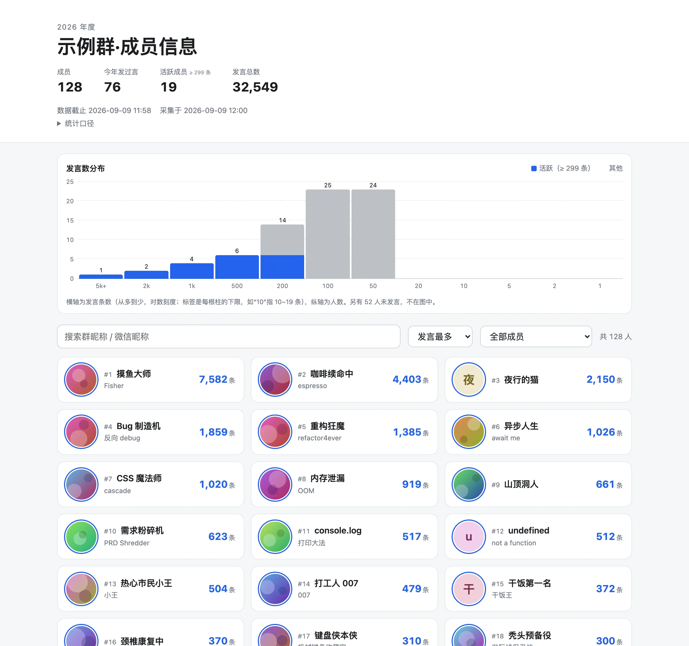

<div align="center">

# wegroup-members

**WeChat group member wall — yearly message stats, rendered as a zero-JS static site.**

[](https://nodejs.org/)
[](https://pnpm.io/)
[](https://www.typescriptlang.org/)
[](https://astro.build/)
[](https://biomejs.dev/)
[](https://pages.cloudflare.com/)
[](#%EF%B8%8F-how-it-works)
[](#-privacy-design)
[](./LICENSE)

English | [简体中文](./README.zh-CN.md)

<picture>
  <source media="(prefers-color-scheme: dark)" srcset="./docs/screenshots/site-dark.webp">
  
</picture>

<sub>Screenshot uses randomly generated mock data (<code>pnpm mock</code>) — no real group data is ever committed.</sub>

</div>

---

Collect member info (nickname, avatar) and yearly message counts for a WeChat group from a locally running [Chatlog](https://github.com/imldy/chatlog) instance, and generate a static member-wall website ready to deploy on Cloudflare Pages.

The codebase is group-agnostic: point it at any group via a local config file. **No group-specific data ever enters this repository** — see [Privacy design](#-privacy-design).

## ✨ Features

- **Member wall**: card grid with avatar, display name, message count and rank, built as a zero-island Astro static site (no framework JS shipped to the browser; only one small vanilla `<script>` for filtering/sorting)
- **Yearly message ranking**: counts messages from Jan 1 to the collection date, deduplicated by `seq`, with a clearly stated counting rule shown on the site
- **Active member highlight**: members whose message count reaches the top 25% (P75) among those who posted at all; the threshold is computed at build time and displayed next to the label
- **Message distribution histogram**: log-scale buckets with "nice" 1-2-5 boundaries, auto-adapting to 10–30 bars for any group, stacked by active/others — pure HTML/CSS, no SVG
- **Search / sort / filter** in the browser: by name, most/fewest messages, all/active/posted-only
- **Avatar localization**: originals are downloaded with strict validation (HTTPS `wx.qlogo.cn` host allowlist, size cap, magic-number check, decompression-bomb guard), then re-encoded to 256×256 WebP with all metadata stripped; filenames are salted hashes, never wxids
- **Two output modes** — see below. The default is the safe one.

## 🔀 Output modes

| Mode | Command | Contents | Deployable |
|---|---|---|---|
| **public** (default) | `pnpm collect` | Strips `wxid`, `alias` (WeChat ID) and `remark` (collector's private notes) from every member record. Only info that is already visible to fellow group members remains: group nickname, WeChat nickname, avatar, message count. | Yes — this is the mode meant for deployment and sharing with group members |
| **private** | `pnpm collect:private` | Full records including `wxid` / `alias` / `remark`. For the collector's own local browsing only. The site renders a sticky red warning banner when it detects a private build. | **No. Never deploy.** |

The strip list has a single source of truth: `PUBLIC_STRIPPED_FIELDS` in `scripts/collect.ts`, typed as `(keyof Member)[]` so a typo fails `typecheck`. The output is self-describing: `config.mode` and `config.omittedFields` tell the web layer what was removed, so nothing is hardcoded downstream.

## ⚙️ How it works

```
Chatlog HTTP API          contact.db (read-only)
(members, messages)       (alias / nickname / avatar URL)
        └──────────┬──────────────┘
                   ▼
        scripts/collect.ts  ──►  web/src/data/members.json   (gitignored)
        scripts/lib/avatars.ts ► web/public/avatars/*.webp   (gitignored)
                   ▼
              astro build   ──►  web/dist/   (data inlined into HTML at build time)
```

`members.json` is imported in Astro frontmatter — it is consumed at build time and never shipped; `web/dist/` contains no `.json` at all.

## 📋 Prerequisites

- Node.js ≥ 22.18 (runs `.ts` natively via type stripping — no tsx/ts-node/build step)
- pnpm
- [Chatlog](https://github.com/imldy/chatlog) running locally (default `http://127.0.0.1:5030`) with its decrypted `contact.db` available on disk

## 🚀 Quick start

```bash
pnpm install

# 1. Create your group config (gitignored, stays on your machine)
cp group.example.json group.local.json
#    ...then edit group.local.json with your group's values

# 2. Collect: members + contact info + yearly counts + avatars
pnpm collect                      # public mode (default, deployable)
pnpm collect -- --year 2025       # a different year

# 3. Build & preview the site
pnpm web:build                    # → web/dist/
pnpm web:preview
```

> **No WeChat data handy?** Run `pnpm mock` to generate a fully fictional dataset (names, avatars, counts) and preview the site immediately — that's what the screenshot above uses. Re-run `pnpm collect` to switch back to real data.

### `group.local.json` fields

See [`group.example.json`](./group.example.json):

| Field | Required | Description |
|---|---|---|
| `groupName` | ✔ | Full group name (kept as an identifier in `config`) |
| `groupShortName` | | Short name used in `<title>` / `h1`; defaults to `groupName` |
| `chatroomId` | ✔ | The `xxx@chatroom` id, exact-matched against the Chatlog chatroom API |
| `chatlogBase` | ✔ | Chatlog HTTP base URL, e.g. `http://127.0.0.1:5030` |
| `contactDb` | ✔ | Path to Chatlog's decrypted `contact.db` (opened read-only; `~` expands) |

### CLI flags

`scripts/collect.ts` accepts (append after `pnpm collect --`):

| Flag | Default | Description |
|---|---|---|
| `--config <path>` | `group.local.json` | Group config file |
| `--year <n>` | current year | Statistics year (Jan 1 → collection date) |
| `--out <dir>` | `web/src/data` | Where `members.json` is written |
| `--avatars-dir <dir>` | `web/public/avatars` | Where avatar WebPs are written |
| `--no-avatars` | off | Skip avatar download (stats only; `avatar` all `null`) |
| `--private` | off | Private mode (see above) |

## 🧰 Commands

| Command | What it does |
|---|---|
| `pnpm collect` | = `collect:public`: collect data + avatars, public mode |
| `pnpm collect:private` | Full output incl. private fields — local use only |
| `pnpm mock` | Generate fictional demo data + avatars (for preview/screenshots) |
| `pnpm web:dev` | Astro dev server |
| `pnpm web:build` | Static build → `web/dist/` |
| `pnpm web:preview` | Preview the built site |
| `pnpm web:deploy` | Build + privacy checks + upload to Cloudflare Pages (see [Deployment](#%EF%B8%8F-deployment)) |
| `pnpm typecheck` | `tsc --noEmit` (scripts) + `astro check` (web) |
| `pnpm lint` / `pnpm lint:fix` | Biome lint (+ fix) |
| `pnpm format` | Biome format |

## 📏 Counting rules

- System messages (`type=10000`) and records with missing/invalid senders are excluded (Chatlog occasionally stuffs XML into the `sender` field for quoted messages; senders are validated against a wxid pattern)
- Everything else counts as a message: text, images, videos, **stickers**, links/quotes/files
- Only members present at collection time are included; messages from people who have since left the group are not counted
- The exact rule and the data-cutoff timestamp are embedded in `config.countingRule` and displayed on the site

## 🔒 Privacy design

The guiding principle: **the code is harmless, the data is not** — so they are strictly separated.

- **Nothing group-specific is committed.** `data/`, `web/src/data/`, avatars, `*.local.json` and `.env*` are all gitignored. Group names, chatroom ids and machine paths appear only in `group.local.json` (or CI env vars), never in tracked files
- **Safe by default.** Running `pnpm collect` with no flags produces the stripped public output; you have to explicitly opt into `--private`, and the site loudly warns if you preview a private build
- **The public build shows only what group members can already see about each other** — group nickname, WeChat nickname, avatar — plus a message count. No chat content, no WeChat IDs, no collector notes
- **Avatars**: fetched only from `https://wx.qlogo.cn/` for verified group members (resolved by wxid, never by nickname; host re-checked on every redirect hop), size- and format-validated before decoding, re-encoded with metadata stripped, and saved under salted-hash filenames
- **Data never leaves the machine implicitly**: Chatlog is queried only for the target group and time range; `contact.db` is opened read-only
- **Deployment is gated**: deploys must sit behind Cloudflare Access or a password; going public requires consent from the group / group owner. The page also carries `noindex, nofollow`

## ☁️ Deployment

Because the data is not in git, connect-to-git auto builds won't work. Build locally and upload the artifact directly.

**Hard rule: the deployment must be protected by Cloudflare Access or a password.** This repo ships a password gate as a Pages Functions middleware ([`functions/_middleware.ts`](./functions/_middleware.ts)): it intercepts every path (avatars included), serves a WeChat-WebView-friendly login form, and fails closed (503) if no password is configured. A shared password was chosen over CF Access because group members don't share an email domain for an Access policy.

One-time setup:

```bash
# 1. Create the Pages project
pnpm exec wrangler pages project create <project-name> --production-branch main

# 2. Store the site password (keep the plaintext in site-password.local — gitignored —
#    it is your only record; the secret cannot be read back from Cloudflare)
pnpm exec wrangler pages secret put SITE_PASSWORD --project-name <project-name> < site-password.local
```

Then deploy (and redeploy after every `pnpm collect`):

```bash
pnpm collect
pnpm web:deploy
```

`pnpm web:deploy` (`scripts/deploy.ts`) refuses to upload a `private`-mode build, rebuilds the site, re-verifies the artifact (no `.json` files, no stripped-field traces in the HTML), and only then runs `wrangler pages deploy` — which also bundles the `functions/` password gate. Set `PROJECT_NAME` at the top of the script if you named your project differently.

To rotate the password: edit `site-password.local`, re-run the `secret put` command above, then redeploy. Sessions are stateless HMAC cookies derived from the password, so rotating it instantly invalidates everyone.

## 🙏 Acknowledgements

- [Chatlog](https://github.com/imldy/chatlog) — local WeChat chat-history service this project reads from
- [Astro](https://astro.build/) — static site framework
- [sharp](https://sharp.pixelplumbing.com/) — avatar re-encoding

Detailed engineering conventions and decision records live in [`AGENTS.md`](./AGENTS.md) (in Chinese).

## 📄 License

[MIT](./LICENSE)
